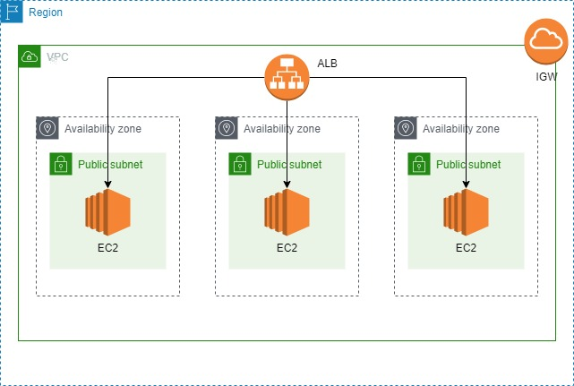

# Three tier architecture on AWS
Demo project for deploying a 3 tier architecture on AWS. You can use the code into this repository to deploy a demo
application in a fault tolerant and high available manner.

## Overview
The picture below represents the architecture we will deploy:



We will install a web server, an application server and a db server in each EC2. The instances span across 3 different
Availability Zones to ensure a certain degree of fault tolerance and high availability. The DB will be a Mongo deployed
as a replica set, and the db engine itself will take care of the synchronization across the 3 AZs.

## Project structure

The code is organized in several folders. Here a brief description of each one.
- *network*: this folder contains a terraform module used to deploy all the network resoruces needed by the application,
such as VPC, subnets, route tables etc...
- *infra*: in this folder there is a module used to deploy the infrastructure resources over the network built. We use this
module to deploy EC2, Elastic Load Balancer etc...
- *config*: here we store all the configuration managment part. In particular, there are 3 Ansible playbooks used to
configure, respectively a database (Mongo), an application server (NGINX Unit) and a web server (NGINX)
- *src*: this folder contains the real web server and application server source code, nothing more complex than two Flask 
application with a trivial RESTful API.
- *deploy*: this last folder contains all the utility scripts (Bash and Python) that can be used to automatically deploy 
all the infrastructure and start or stop the EC2 instances

For further details, every folder contains a README.md.

## Quick deploy
If you do not change the structure of this repo, deploying the project is pretty simple.

***NOTE: you should have an AWS account. All the resources deployed are included in the Free Tier but make sure to destroy everything when you are done!***

### Prerequisites
You need to install in your system the following tools/packages/whatever they are called:
- [Ansible](https://docs.ansible.com/ansible/latest/installation_guide/intro_installation.html)
- [Terraform](https://learn.hashicorp.com/tutorials/terraform/install-cli)
- [Python 3.X](https://www.python.org/downloads/)
- [AWS CLI](https://docs.aws.amazon.com/cli/latest/userguide/install-cliv2-linux.html#cliv2-linux-prereq)

You need also to configure a *credentials* file for the AWS CLI, read [here](https://docs.aws.amazon.com/cli/latest/userguide/cli-configure-files.html)

### Deploy

***NOTE: The architecture deployed will be open to the world. If you want to restrict access to the application, 
change the varibale values in main.tf. To understand the meaning of each value, take a look at the README.md 
into infra and network folders***

***IMPORTANT: substitute the id_rsa.pub file with your id_rsa.pub. Without doing this, Ansible will not be able to
connect to the instance and configure them***

You need to position into the *deploy* folder
```> cd deploy ```
***OPTIONAL***: create a python virtual environment, to avoid conflicts and let your system clean
```
> python3 -m venv venv
> source ./venv/bin/activate
```
Install the required python packages
```
(venv)> pip install -r requirements
```
Modify the provider.tf variables according to you preferences. I suggest to change only ***shared_credentials_file***
and ***profile*** values. For more information, read [here](https://registry.terraform.io/providers/hashicorp/aws/latest/docs)

Now you are ready to deploy!
```
(venv)> ./deploy.sh <your_aws_profile> <aws_region_name>
```

### Test
It simple as `cd deploy && ./tests.sh` :)