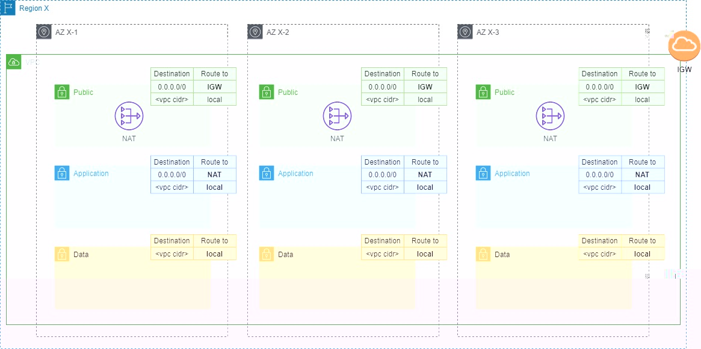

# Network

We use this Terraform module to deploy all the networking component needed by a 3 tier architecture. We will deploy the 
following resources:

- [aws_vpc](https://registry.terraform.io/providers/hashicorp/aws/latest/docs/resources/vpc)
- [aws_subnet](https://registry.terraform.io/providers/hashicorp/aws/latest/docs/resources/subnet), three (public, application and data) per AZs to ensure high availability of the solution proposed.
- [aws_internet_gateway](https://registry.terraform.io/providers/hashicorp/aws/latest/docs/resources/internet_gateway), one for each public subnet
- [aws_nat_gateway](https://registry.terraform.io/providers/hashicorp/aws/latest/docs/resources/nat_gateway), to allow internet access
- [aws_route_table](https://registry.terraform.io/providers/hashicorp/aws/latest/docs/resources/route_table)
- [aws_eip](https://registry.terraform.io/providers/hashicorp/aws/latest/docs/resources/eip), (AWS Elastic IP) one address for each NAT Gateway.

The image below is a visual representation of the network deployed:




## Input
| Name | Type | Description | Notes |
|------|------|-------------|-------|
| application_subnet_cidrs | list(string) | CIDRs for the application subnets | |
| availability_zones | list(string) | The list of AZs where to deploy the network | |
| data_subnet_cidrs | list(string) | CIDRs for the data subnets | |
| public_subnet_cidrs | list(string) | CIDRs for the public subnets | |
| tags | map(string) | Tags for the network resources | |
| vpc_cidr_block | string | CIDR block of the VPC | |
| vpc_enable_dns_hostname | bool | A boolean flag to enable/disable DNS hostname in the VPC | true by default |
| vpc_enable_dns_support | bool | A boolean flag to enable/disable DNS support in the VPC | true by default |
| vpc_name | string | A human friendly name for the VPC | |


## Output
| Name | Description |
|------|-------------|
| application_subnets | Data of the application subnets |
| application_subnets_rt | Data of the route tables associated to the application subnets |
| data_subnets | Data of the data subnets |
| data_subnets_rt | Data of the route tables associated to the data subnets |
| internet_gw | Data of the internet gateway |
| nat_gw | Data of the NAT gateway |
| public_subnets | Data of the public subnets |
| public_subnets_rt | Data of the route tables associated to the public subnets |
| vpc | VPC data |

## Usage
```
module "network" {
  source = "/path/to/this/module"
  
  vpc_name                 = "AwesomeVPC"
  vpc_cidr_block           = "10.0.0.0/18"
  availability_zones       = ["eu-central-1a", "eu-central-1b", "eu-central-1c"]
  public_subnet_cidrs      = ["10.0.0.0/24", "10.0.1.0/24", "10.0.2.0/24"]
  application_subnet_cidrs = ["10.0.3.0/24", "10.0.4.0/24", "10.0.5.0/24"]
  data_subnet_cidrs        = ["10.0.6.0/24", "10.0.7.0/24", "10.0.8.0/24"]
  tags                     = { Env = "prod", Project = "Awesome" }
}
```

