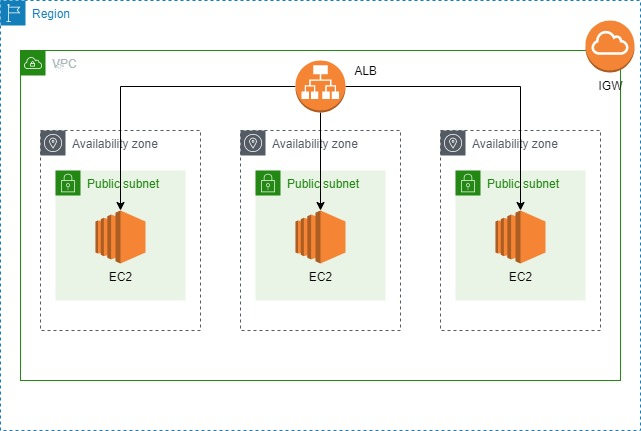

# Infrastructure

This module is used to deploy the follwing resoources:
- [aws_instance](https://registry.terraform.io/providers/hashicorp/aws/latest/docs/resources/instance)
- [aws_lb](https://registry.terraform.io/providers/hashicorp/aws/latest/docs/resources/lb)
- [aws_lb_listener](https://registry.terraform.io/providers/hashicorp/aws/latest/docs/resources/lb_listener)
- [aws_lb_target_group](https://registry.terraform.io/providers/hashicorp/aws/latest/docs/resources/lb_target_group)
- [aws_key_pair](https://registry.terraform.io/providers/hashicorp/aws/latest/docs/resources/key_pair)
- [aws_security_group](https://registry.terraform.io/providers/hashicorp/aws/latest/docs/resources/security_group)

The image below is a visual representation of the network deployed:

## Input
| Name | Type | Description | Notes |
|------|------|-------------|-------|
| ami | string | AMI id for the servers | Default is ami-00f22f6155d6d92c5 (Amazon linux 2 on Frankfurt) |
| associate_public_ip_address | bool | Whether to attach or not a public IP address to the EC2 | Default is true |
| db_port | number | Database port | Default is 27017 (Mongo DB) |
| ec2_cidr_az_mapping | map(string) | Mapping az => cidr for the servers | |
| external_traffic_cidrs | list(string) | CIDR for security group egress rule | |
| extra_security_group_id | list(string) | IDs of extra security group to be attached to the server | |
| ingress_traffic_cidrs | list(string) | CIDR for the security group ingress rule | |
| instance_size | string | Size of the server | Default is t2.micro | |
| public_listener_port | number | Port for the forward rule of the public layer listener | Default is 80 |
| public_listener_protocol | string | Protocol for the forward rule of the public layer listener | |
| public_subnets | list(string) | Subnet ids for the load balancer | |
| ssh_sources | list(string) | Addresses allowed to SSH into the deployed instances | |
| subnets_cidr | list(string) | CIDR of the subnets where to deploy the EC2 instances | |
| tags | map(string) | Tags for all the resources created | | 
| vpc_id | string | VPC id where to deploy the infrastructure | |

## Output
| Name | Description |
|------|-------------|
| instances | The deployed servers |
| load_balancer | The deployed load balancer |
| load_balancer_listener | The load balancer listener |
| security_group | The security group for the deployed servers |
| ssh_key | The ssh key imported to AWS |
| target_group | The target group for the servers |